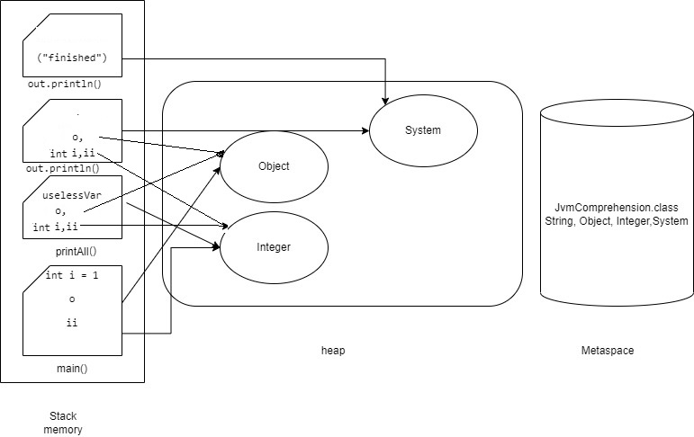

### How JVM works (Classloader)**
Набор операций, на основе которых работает ClassLoader:

- Виртуальная машина проверяет, загружен ли класс или нет, всякий раз, когда он сталкивается с классом.
- В случае, когда класс загружен, JVM продолжает выполнение класса, но когда класс не загружен, JVM просит подсистему ClassLoader загрузить этот конкретный класс. После этого подсистема передает управление Application ClassLoader.
- Затем Application делегирует запрос Extension, которое затем передает запрос Bootstrap .
- Теперь Bootstrap ищет в пути Bootstrap classpath, чтобы проверить, доступен ли класс или нет. Если класс доступен, он загружается, в противном случае запрос снова передается в Extension.
- Extension проверяет класс в расширении classpath. Если класс доступен, он загружается, в противном случае запрос снова передается в Application.
- Наконец, Application ищет класс в пути к классам приложения. Если класс доступен, то загружается, иначе вы увидите исключение ClassNotFoundException.

** Начинает работать с файлом .class (bytecode). В нашем случаем подгружается сам класс JvmComprehension и все классы, которые в нем есть:String, Integer,Object,System.
Итак, Classloader загрузил все что нашел из анализируемого класса JvmComprehension 
### Что же происходит во время подгрузки данных Classloaderом
Linking (связывание):
1. Verify (проверка на то, что данная программа компилируемая, в ней нет синтаксических ошибок).
В нашем случае проверяется класс JvmComprehension и его методы 
2. Prepare (подготовка примитивов в статических полях). В нашем случае этого нет.
3. Resolve (разрешение символьных ссылок). В случае если были бы какие -либо импортируемые данные из других пакетов,
например, java.util.Scanner, они подгружались бы, но в нашем коде этого нет. Следовательно подгружаться ничего не будет.
### Memory в Java
Память в Java состоит из трех компонентов: 
- куча (Heap space), 
- стек (Stack space)
- метапространство (Metaspace):

Итак,
Metaspace: тут Java хранит неизменяемую информацию программы, например классы.
Heap space: в этой области хранится изменяемый контент.
Stack space: в стеке хранятся переменные, созданные в методах, и ссылки на переменные.

Что получается в нашем случае:

### How GC works
С помощью утилиты VisualGC отслеживаем работу сборщика мусора.

По мере работы программы можно увидеть как заполоняется Metaspace (заполняется классами:
JvmComprehension, String,Object,Integer,System).

Как данные заполняются в Eden, происходит сбор мусора, при этом происходит 
полная остановка программы (но ее в принципе практически не видно), мертвые объекты (не используемые, на которые нет ссылок, удаляются, а так называемые 
"выжившие данные" переходят в область Survivor 0 или Survivor 1, при этом одна из областей
Survivor 1 или Survivor 0 всегда должна быть пуста. 

В итоге, прошедшие несколько циклов сборки мусора и "выжившие объекты"
переходят в Old generation, где проверяются на наличие так называемого "мусора" реже.